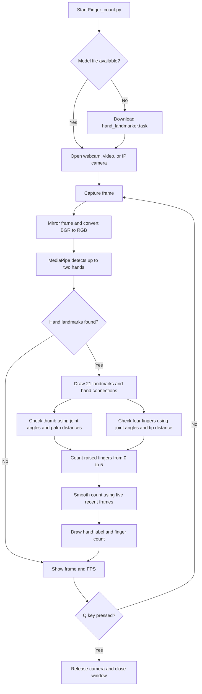
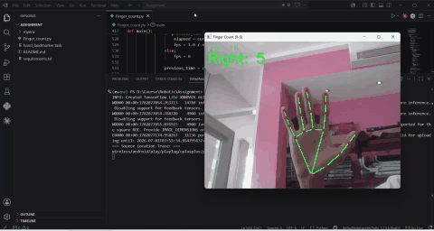

# Finger Detection and Counting using MediaPipe

This project detects hands in real time, tracks hand landmarks, and counts how many fingers are raised using MediaPipe and OpenCV.

## How the System Works



The program processes each camera frame with MediaPipe, evaluates the thumb and four fingers using joint angles and normalized palm distances, and smooths the result over five recent frames to reduce flickering.

## Video Demo

[](finger-detect.mp4)

The preview plays automatically. Click it to open the full-quality [MP4 video](finger-detect.mp4).

## What It Does

- Detects one or two hands from a webcam or IP camera stream.
- Tracks the 21 MediaPipe hand landmarks.
- Counts raised fingers from 0 to 5 for each detected hand.
- Displays the live result on the camera frame.
- Press `q` to close the camera window.

## Requirements

- Python 3.10 or newer
- Webcam, external camera, or IP camera stream
- Windows, macOS, or Linux

This version uses the current MediaPipe Tasks API. On the first run, the program downloads `hand_landmarker.task` into the project folder.

## Project Structure

```text
Finger_Detection_Assignment/
├── Finger_count.py
├── README.md
├── requirements.txt
└── hand_landmarker.task
```

## Setup

Create a virtual environment:

```powershell
python -m venv myenv
```

Activate it on Windows:

```powershell
.\myenv\Scripts\activate
```

Activate it on macOS or Linux:

```bash
source myenv/bin/activate
```

Install the required libraries:

```powershell
pip install -r requirements.txt
```

## Run

Start the program with the default webcam:

```powershell
python Finger_count.py
```

If `hand_landmarker.task` is missing, it will be downloaded automatically on the first run.

Use another camera index:

```powershell
python Finger_count.py --camera 1
```

Use an IP camera stream:

```powershell
python Finger_count.py --camera "http://192.168.1.10:8080/video"
```

## How Finger Counting Works

MediaPipe returns hand landmarks with normalized `x` and `y` coordinates. The program counts fingers by comparing each fingertip position with a lower finger joint:

- Index, middle, ring, and pinky are counted as raised when their tip is above the PIP joint.
- The thumb is counted using horizontal position because it moves sideways relative to the other fingers.
- Left and right hands use opposite thumb comparisons.

## Troubleshooting

If the camera does not open, check that no other app is using it. If you use an external camera, try `--camera 1` or `--camera 2`.

If `mediapipe` fails to install, check your Python version:

```powershell
python --version
```

Use Python 3.10 or 3.11 for the most reliable installation.
