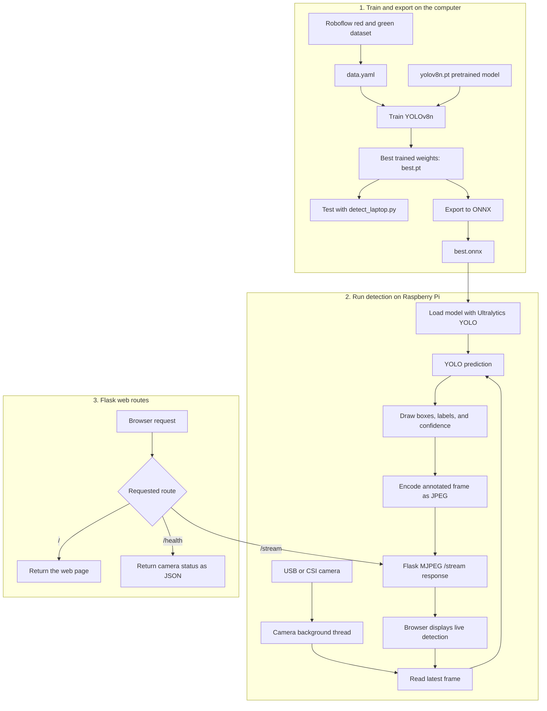

 # YOLOv8 Red and Green Object Detection

This assignment trains, exports, and deploys a YOLOv8 model for detecting red and green objects, using a Roboflow dataset and Raspberry Pi deployment with ONNX.

## How the System Works



At runtime, the camera thread continually saves the newest frame. When a browser opens `/stream`, the server repeatedly copies that frame, runs YOLO detection, draws the results, converts the image to JPEG, and sends it as an MJPEG stream. The browser also calls `/health` every four seconds to show whether the camera is available.

## Detection Demo

[](red_green_detection.mp4)

The preview plays automatically. Click it to open the full-quality [MP4 video](red_green_detection.mp4).

## Configuration

| Item | Recommended value | Notes |
| --- | --- | --- |
| Model architecture | YOLOv8n | Nano model for Raspberry Pi speed |
| Image size | 320 x 320 | Good balance between accuracy and speed |
| Batch size | 16 | Lower this if GPU memory is limited |
| Training epochs | 200 | Stop earlier if loss stabilizes |
| Confidence threshold | 0.4 to 0.5 | Filters weak detections |
| ONNX opset | 12 | Compatible with ONNX Runtime 1.16+ |
| Raspberry Pi | Pi 4, 2 GB to 4 GB | 64-bit OS recommended |
| Camera | USB or CSI camera | Test with `cv2.VideoCapture(0)` |
| Python | 3.10+ | Use a virtual environment |

## Project Structure

```text
Assignment2/
├── README.md
├── app_pi_stream.py
├── detect_laptop.py
├── requirements-pi.txt
├── requirements-windows.txt
└── data.yaml.example
```

After downloading the Roboflow dataset, the training dataset should look like this:

```text
Assignment2/
├── train/
├── valid/
└── data.yaml
```

## 1. Download Dataset from Roboflow

1. Open the Roboflow red-green detection dataset page.
2. Choose `Download Dataset`.
3. Select `YOLOv8` format.
4. Extract the downloaded files inside `Assignment2`.

Confirm that `data.yaml` contains paths and labels similar to this:

```yaml
train: ../train/images
val: ../valid/images
nc: 2
names: ['redbox', 'greenbox']
```

If the dataset is extracted directly inside `Assignment2`, the paths may need to be:

```yaml
train: train/images
val: valid/images
nc: 2
names: ['redbox', 'greenbox']
```

## 2. Set Up Training Environment on Windows

Open PowerShell inside `Assignment2`.

Create and activate a virtual environment:

```powershell
python -m venv yolo
.\yolo\Scripts\activate
```

Install the training requirements:

```powershell
pip install --upgrade pip
pip install torch torchvision torchaudio --index-url https://download.pytorch.org/whl/cu121
pip install -r requirements-windows.txt
```

Verify the installation:

```powershell
yolo version
```

## 3. Train the YOLOv8 Model

Train with GPU:

```powershell
yolo detect train model=yolov8n.pt data=data.yaml imgsz=320 epochs=200 batch=16 device=0
```

For a quick test run, reduce epochs:

```powershell
yolo detect train model=yolov8n.pt data=data.yaml imgsz=320 epochs=10 batch=16 device=0
```

If your computer does not have a CUDA GPU, use CPU or train on Google Colab:

```powershell
yolo detect train model=yolov8n.pt data=data.yaml imgsz=320 epochs=200 batch=16 device=cpu
```

After training, the best weights are saved here:

```text
runs/detect/train/weights/best.pt
```

Copy `best.pt` into the `Assignment2` folder before running the laptop test script.

## 4. Test the Model on a Laptop

Run webcam detection:

```powershell
python detect_laptop.py --model best.pt --camera 0 --conf 0.5
```

Press `q` to close the OpenCV window.

You can also use another camera index or a video file:

```powershell
python detect_laptop.py --model best.pt --camera 1
python detect_laptop.py --model best.pt --camera video.mp4
```

## 5. Export Model to ONNX for Raspberry Pi

Export the trained model:

```powershell
yolo export model=best.pt format=onnx imgsz=320 opset=12 dynamic=False simplify=False nms=True
```

This creates:

```text
best.onnx
```

## 6. Transfer Model to Raspberry Pi

Replace `pi-ip` with your Raspberry Pi IP address:

```powershell
scp best.onnx aupp@pi-ip:/home/aupp/Documents/
scp app_pi_stream.py requirements-pi.txt aupp@pi-ip:/home/aupp/Documents/
```

## 7. Set Up Raspberry Pi Environment

On the Raspberry Pi:

```bash
cd /home/aupp/Documents
python3 -m venv ~/yolo
source ~/yolo/bin/activate
pip install --upgrade pip
pip install -r requirements-pi.txt
```

## 8. Run ONNX Web Stream on Raspberry Pi

Start the Flask stream server:

```bash
python app_pi_stream.py --model best.onnx --camera 0 --host 0.0.0.0 --port 5000
```

Open this URL from a browser on the same network:

```text
http://pi-ip:5000
```

The page shows the live camera stream with YOLOv8 detections drawn on each frame.

## Troubleshooting

If the camera does not open, check whether another program is using it. Try `--camera 1` for an external USB camera.

If CUDA is not available on Windows, use `device=cpu` or train in Google Colab.

If Raspberry Pi inference is slow, lower the camera resolution, use `imgsz=320`, and keep the YOLOv8n model.
